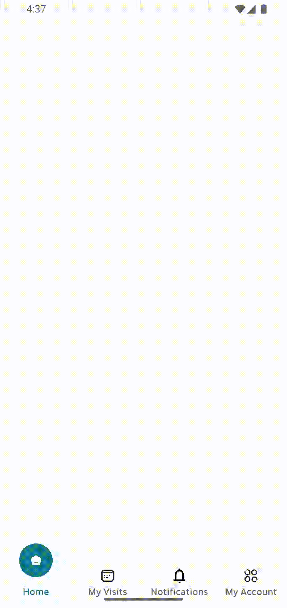

# Flutter Stacked Navbar

> **Flutter Stacked Navbar** is a customizable and flexible navigation bar built for Flutter applications, designed to work seamlessly.

---

## 📸 Preview



---

## ✨ Features

- 🚀 **Easy Integration** with Stacked ViewModels.
- 🎨 **Highly Customizable** — colors, shapes, animations, and icons.
- 📱 **Responsive** — works on mobile, tablet, and web.
- 🔄 **Dynamic Navigation** based on ViewModel state.

---

## 📦 Installation

Add the package to your `pubspec.yaml`:

```yaml
dependencies:
  flutter_stacked_navbar: ^0.0.1
```

Then run:
```terminal
flutter pub get
```

🚀 Usage
Here’s a quick example of using StackedNavbar inside an app:
```dart
StackedNavbar(
  navItems: [
    NavItem(
      title: "Home",
      icon: Icon(Icons.home),
      iconSelected: Icon(Icons.home),
    ),
    NavItem(
      title: "My Visits",
      icon: Icon(Icons.calendar),
      iconSelected: Icon(Icons.calendar),
    ),
  ],
  onTabClicked: (index) {},
  activeNavColor: Colors.blueGrey,
  activeLabelColor: Colors.blueGrey,
  inactiveLabelColor: Colors.black,
)
```